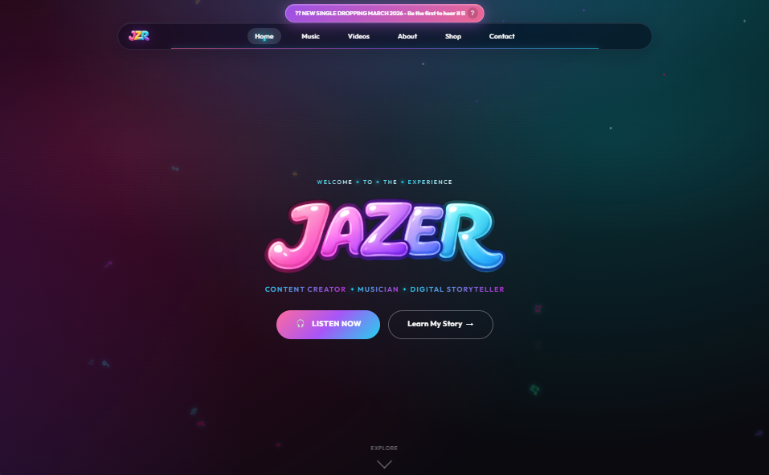
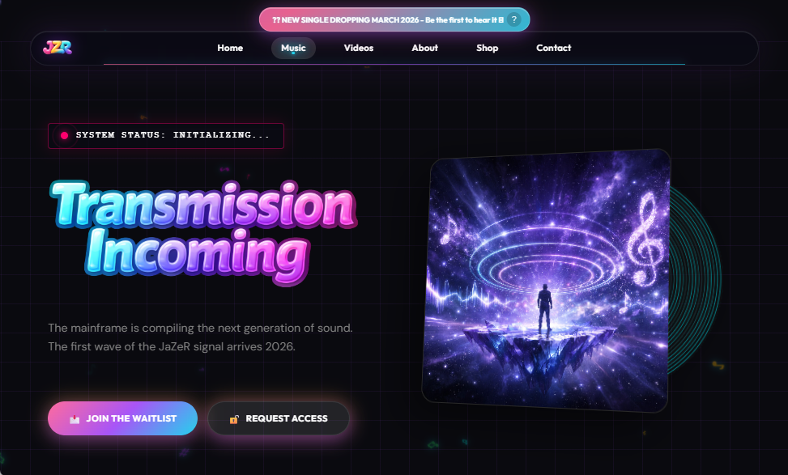
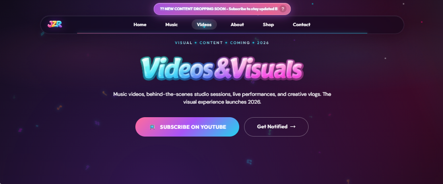
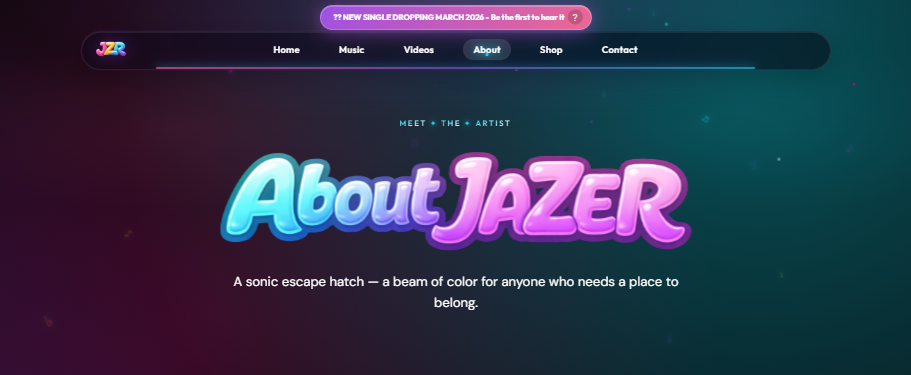
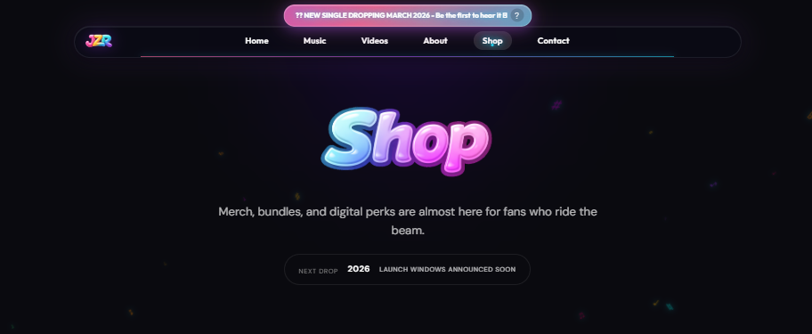
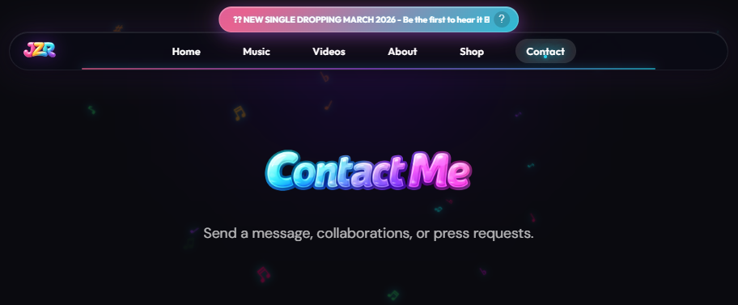

<div align="center">


# 🎶 JaZeR Official Website

<h3>Content Creator • Musician • Digital Storyteller</h3>

[](https://jazer-444.github.io/TEST-Website-Import/)
[](https://astro.build)
[](https://pages.github.com/)
[](#️-license--legal)
[](https://jazer-444.github.io/TEST-Website-Import/)


> *"JaZeR is a sonic escape hatch — a beam of color for anyone who needs a place to belong."*

---

### 🚀 Quick Actions

<table>
<tr>
<td align="center" width="33%">
<a href="https://jazer-444.github.io/TEST-Website-Import/">

</a>
<br/>
<sub>Experience the site in action</sub>
</td>
<td align="center" width="33%">
<a href="#-quick-start">

</a>
<br/>
<sub>Run locally in 60 seconds</sub>
</td>
<td align="center" width="33%">
<a href="https://github.com/JaZeR-444/TEST-Website-Import/issues">

</a>
<br/>
<sub>Found a bug? Let us know</sub>
</td>
</tr>
</table>

---

### ✨ Page Navigation

<p align="center">
  <a href="https://jazer-444.github.io/TEST-Website-Import/">🏠 <strong>Home</strong></a> •
  <a href="https://jazer-444.github.io/TEST-Website-Import/music">🎵 Music</a> •
  <a href="https://jazer-444.github.io/TEST-Website-Import/videos">📺 Videos</a> •
  <a href="https://jazer-444.github.io/TEST-Website-Import/about">👤 About</a> •
  <a href="https://jazer-444.github.io/TEST-Website-Import/shop">🛍️ Shop</a> •
  <a href="https://jazer-444.github.io/TEST-Website-Import/contact">📫 Contact</a>
</p>

</div>

---

## 🆕 What's New (January 2026)

> **💡 Latest Updates**: Check out the newest features and improvements below!

<table>
  <tr>
    <td width="10%" align="center">🚀</td>
    <td width="90%"><strong>Astro 5.0 Migration</strong> — Modern static site generation with component architecture</td>
  </tr>
  <tr>
    <td align="center">📱</td>
    <td><strong>Mobile Experience Enhanced</strong> — Improved touch targets, smoother animations, better responsive layout</td>
  </tr>
  <tr>
    <td align="center">⚡</td>
    <td><strong>Performance Optimized</strong> — Self-hosted fonts, optimized images, <2s load time on mobile</td>
  </tr>
  <tr>
    <td align="center">🎨</td>
    <td><strong>Dynamic Color Cycling</strong> — Automated theme color rotation through JaZeR brand palette</td>
  </tr>
  <tr>
    <td align="center">🤖</td>
    <td><strong>Automated CI/CD</strong> — GitHub Actions deployment pipeline for instant updates</td>
  </tr>
</table>

<div align="right">
<a href="#-jazer-official-website">⬆️ Back to Top</a>
</div>

---

## 🎨 Preview

<div align="center">

### 🖥️ Desktop Experience

<kbd></kbd>

<sub>*Homepage featuring hero section, dynamic animations, and brand identity*</sub>

---

### 📄 All Pages Showcase

<table>
<tr>
<td width="50%" align="center">
<kbd></kbd>
<br/><br/>

<br/>
<sub><strong>Music Releases & Streaming Links</strong></sub>
</td>
<td width="50%" align="center">
<kbd></kbd>
<br/><br/>

<br/>
<sub><strong>Video Content & Media</strong></sub>
</td>
</tr>
<tr>
<td width="50%" align="center">
<kbd></kbd>
<br/><br/>

<br/>
<sub><strong>Artist Story & Biography</strong></sub>
</td>
<td width="50%" align="center">
<kbd></kbd>
<br/><br/>
<strong>🛍️ SHOP</strong>
<br/>
<sub><strong>Merchandise & Products</strong></sub>
</td>
</tr>
<tr>
<td width="50%" align="center" colspan="2">
<kbd></kbd>
<br/><br/>

<br/>
<sub><strong>Get In Touch & Connect</strong></sub>
</td>
</tr>
</table>

> 📸 **Note**: Screenshots showcase the glassmorphic dark theme, vibrant brand colors, and responsive Astro-powered design.

</div>

<div align="right">
<a href="#-jazer-official-website">⬆️ Back to Top</a>
</div>

---

## 📋 Table of Contents

> **📖 Documentation Guide**: Navigate through all sections quickly

### 📌 Emoji Legend

<details>
<summary><strong>Click to view emoji meanings used throughout this README</strong></summary>

<br/>

| Emoji | Meaning | Usage |
|:-----:|---------|-------|
| 🎶 🎵 | Music & Audio | Music-related content, streaming, releases |
| 📺 📹 | Video & Media | Video content, visual media |
| 🎨 | Design & Branding | Design, colors, visual identity |
| ⚡ 🚀 | Performance & Speed | Fast loading, optimization |
| 📱 💻 | Devices | Mobile, desktop, responsive design |
| ♿ | Accessibility | WCAG compliance, screen readers |
| 🔒 🔐 | Security | HTTPS, secure connections |
| 🛍️ | Commerce | Shop, merchandise, products |
| 👤 👥 | People & Community | About, users, community |
| 📧 📫 | Contact | Email, contact forms |
| 🐛 | Bugs & Issues | Bug reports, problems |
| 💡 | Tips & Ideas | Helpful information, suggestions |
| ⚠️ | Warnings | Important notices, cautions |
| ✅ ✓ | Complete | Finished features, checkmarks |
| 🔮 | Future | Planned features, vision |
| 📊 | Statistics | Data, metrics, analytics |

</details>

---

<div align="center">

### 🎯 Quick Navigation

**[🆕 What's New](#-whats-new-january-2026)** • 
**[🎨 Preview](#-preview)** • 
**[🌟 Overview](#-overview)** • 
**[⚡ Quick Start](#-quick-start)** • 
**[✨ Features](#-features)** • 
**[🏗️ Tech Stack](#️-tech-stack)**

**[📁 Project Structure](#-project-structure)** • 
**[🌐 Deployment](#-deployment)** • 
**[🎨 Brand & Design](#-brand--design)** • 
**[📊 Performance](#-quality--performance)** • 
**[🗺️ Roadmap](#️-roadmap--vision)** • 
**[⚖️ License](#️-license--legal)**

</div>

<details>
<summary><strong>📖 Expand Full Documentation Index</strong></summary>

<br/>

<table>
<tr>
<td width="50%" valign="top">

### 🚀 Getting Started
- [🆕 What's New](#-whats-new-january-2026)
- [🎨 Preview & Screenshots](#-preview)
- [🌟 Overview](#-overview)
- [⚡ Quick Start](#-quick-start)

### 💎 Core Features
- [✨ Features](#-features)
- [🏗️ Tech Stack](#️-tech-stack)
- [📁 Project Structure](#-project-structure)
- [🎨 Brand & Design](#-brand--design)

</td>
<td width="50%" valign="top">

### 🔧 Development
- [🌐 Deployment](#-deployment)
- [📊 Quality & Performance](#-quality--performance)
- [🤝 Contributing](#-contributing)

### 📚 Project Info
- [🗺️ Roadmap & Vision](#️-roadmap--vision)
- [❓ FAQ](#-faq)
- [🔗 Connect](#-connect-with-jazer)
- [⚖️ License & Legal](#️-license--legal)

</td>
</tr>
</table>

</details>

---

## 🌟 Overview

This repository powers the **official website** for **JaZeR** — a content creator and music artist building an authentic digital presence. The site showcases music releases, video content, merchandise, and provides a direct connection point for fans and collaborators.

Built with **Astro 5.0, performance-first engineering, and accessibility** in mind, this is a modern static website that delivers a premium experience without unnecessary framework overhead.

### 🎭 What is JaZeR?

<div align="center">

</div>

**JaZeR** is more than just a website—it's a complete digital experience designed to connect music, visuals, and storytelling into one cohesive brand identity. From streaming platforms to social media, this site serves as the **central hub** for:

<table>
  <tr>
    <td align="center">🎵</td>
    <td><strong>Music Releases</strong><br/>Latest tracks across all major platforms (Spotify, Apple Music, SoundCloud, YouTube)</td>
  </tr>
  <tr>
    <td align="center">📺</td>
    <td><strong>Video Content</strong><br/>Behind-the-scenes, music videos, and creative process documentation</td>
  </tr>
  <tr>
    <td align="center">🛍️</td>
    <td><strong>Merchandise</strong><br/>Exclusive JaZeR branded products and limited drops</td>
  </tr>
  <tr>
    <td align="center">👥</td>
    <td><strong>Community Building</strong><br/>Direct fan engagement through contact forms and social integrations</td>
  </tr>
  <tr>
    <td align="center">🎨</td>
    <td><strong>Brand Experience</strong><br/>Immersive dark-themed UI with signature glassmorphic design</td>
  </tr>
</table>

### ✨ Key Highlights

> **🎯 Core Strengths**: What makes this site stand out

```
🎨 Distinctive Brand Identity  →  Custom color palette, typography, and visual system
📱 Mobile-First Design         →  Optimized for fans on the go with responsive layouts
♿ Accessibility Built-In       →  WCAG-compliant contrast ratios, keyboard navigation, ARIA
⚡ Lightning Fast              →  Astro SSG, optimized assets, minimal JavaScript
🧭 Intuitive Navigation        →  Multi-page architecture with clear routing
🎵 Content-Rich Pages          →  Dedicated sections for music, videos, shop, about, contact
🌙 Dark, Glassy UI             →  Modern dark theme with glassmorphic elements
🔍 SEO Optimized               →  Complete meta tags, Open Graph, Twitter Cards
```

<div align="right">
<a href="#-jazer-official-website">⬆️ Back to Top</a>
</div>

---

## ⚡ Quick Start

Get the JaZeR website running locally in under 60 seconds:

### Prerequisites

- Node.js 18+ (for Astro dev server)
- Git for version control

### Installation

```bash
# Clone the repository
git clone https://github.com/JaZeR-444/TEST-Website-Import.git

# Navigate to the project directory
cd TEST-Website-Import

# Install dependencies
npm install
```

### Run Locally

**Available Scripts:**

```bash
# Option 1: Development server with hot reload
npm run dev
# Opens at http://localhost:4321

# Option 2: Build for production
npm run build

# Option 3: Preview production build
npm run preview
```

### View in Browser

Open your browser and navigate to:
```
http://localhost:4321
```

**That's it!** 🎉 The Astro dev server is now running. Make changes to any file and see updates instantly with hot module replacement.

> **💡 Pro Tip**: Use `Ctrl+C` to stop the dev server. Check the terminal for any errors or warnings.

---

<div align="center">

</div>

<div align="right">
<a href="#-jazer-official-website">⬆️ Back to Top</a>
</div>

---

## 🏗️ Tech Stack

This is built with **Astro 5.0** — a modern static site generator that ships zero JavaScript by default, combined with vanilla web technologies for maximum performance.

### Core Technologies

```
┌─────────────────────────────────────────────┐
│                                             │
│  🚀 Astro 5.0    Component architecture     │
│  📄 HTML5        Semantic markup & ARIA     │
│  🎨 CSS3         Custom properties & Grid   │
│  ⚡ JavaScript   Vanilla ES6+ modules       │
│  🔤 Web Fonts    Self-hosted WOFF2 files    │
│  🌐 GitHub Pages Free hosting with HTTPS    │
│  🔗 Custom DNS   CNAME configuration        │
│                                             │
└─────────────────────────────────────────────┘
```

| Layer | Technology | Purpose |
|-------|------------|---------|
| **Framework** | Astro 5.0 | Static site generation, component architecture, zero JS by default |
| **Markup** | HTML5 | Semantic elements, ARIA landmarks, accessibility |
| **Styling** | Vanilla CSS | Custom properties (CSS variables), Grid, Flexbox, glassmorphic effects |
| **Interactivity** | Vanilla JavaScript (ES6+) | DOM manipulation, event handling, animations |
| **Typography** | Self-hosted web fonts | DM Sans, Nunito, Outfit in WOFF2 format |
| **Hosting** | GitHub Pages | Free CDN, automatic HTTPS, CI/CD pipeline |
| **Domain** | Custom DNS | CNAME record configuration |

### Why This Stack?

**Maximum performance, minimal maintenance, complete control.**

> **⚡ Performance First**: Astro ships zero JavaScript by default, resulting in blazing-fast load times.

```
✓ Zero JS by default         ✓ Lightning fast SSG
✓ Component architecture     ✓ No runtime overhead
✓ Full browser support       ✓ Easy to debug
✓ Small file sizes           ✓ Long-term stability
✓ SEO-friendly HTML          ✓ Instant page loads
```

<div align="right">
<a href="#-jazer-official-website">⬆️ Back to Top</a>
</div>

### Architecture Benefits

**Comparing approaches:**

| Aspect | This Approach (Astro) | SPA Framework Alternative |
|--------|----------------------|---------------------------|
| **Build Time** | ⚡ Fast SSG | ⏳ Slower compilation |
| **JavaScript Shipped** | 📦 Only what's needed | 📦 Full framework runtime |
| **Load Time** | 🚀 < 2s | 🐌 3-5s typical |
| **File Size** | 📊 Minimal per page | 📊 Larger bundle |
| **SEO** | 🔍 Perfect (static HTML) | 🔍 Requires extra work |
| **Learning Curve** | 📚 HTML/CSS/JS | 📚 Framework-specific |
| **Maintenance** | 🔧 Minimal updates | 🔧 Constant updates |
| **Deployment** | 🚀 Push to Git | 🚀 Build + Deploy |

<div align="right">
<a href="#-jazer-official-website">⬆️ Back to Top</a>
</div>

---

## 📁 Project Structure

```text
jazer-website/
├── src/
│   ├── components/         # Reusable UI components (Nav, Footer, Player)
│   ├── layouts/            # Page templates (BaseLayout.astro)
│   ├── pages/              # Route pages (/, /music, /videos, etc.)
│   └── content/            # Data-driven content (releases.json)
├── public/
│   ├── assets/             # Images, brand kit, fonts
│   ├── css/                # Modular stylesheets
│   └── js/                 # Vanilla interactions
├── docs/                   # Documentation
│   ├── TECHNICAL.md        # Architecture deep-dive
│   ├── LOGO_PLACEMENTS.md  # Brand guidelines
│   └── jazer-page-screenshots/ # Visual assets
├── astro.config.mjs        # Astro configuration
├── package.json            # Dependencies & scripts
└── README.md               # You are here
```

---

## ✨ Features

### 🎯 Features at a Glance

<div align="center">

| Feature | Description | Status |
|:-------:|-------------|:------:|
| 📱 | **Mobile Responsive** — Works perfectly on all devices | ✅ |
| ♿ | **Accessible** — WCAG 2.1 AA compliant | ✅ |
| ⚡ | **Fast** — < 2s load time, 90+ Lighthouse score | ✅ |
| 🎨 | **Custom Design** — Unique glassmorphic brand identity | ✅ |
| 🌐 | **Multi-Page** — Home, Music, Videos, About, Shop, Contact | ✅ |
| 🔒 | **HTTPS** — Secure by default via GitHub Pages | ✅ |
| 🎵 | **Music Integration** — Links to all streaming platforms | ✅ |
| 📺 | **Video Content** — YouTube embeds and media showcase | ✅ |
| 🛍️ | **Shop Ready** — Merchandise page for products | ✅ |
| 📧 | **Contact Form** — Direct fan communication | ✅ |
| 🚀 | **CI/CD** — Auto-deploy on push to main | ✅ |
| 🎨 | **Dynamic Theming** — Color cycling through brand palette | ✅ |
| 🖼️ | **Optimized Images** — SVG logos and compressed assets | ✅ |
| 🔤 | **Self-Hosted Fonts** — No external font dependencies | ✅ |
| 📊 | **SEO Ready** — Meta tags, Open Graph, Schema markup | ✅ |

</div>

<details>
<summary><b>🔍 Extended Feature List (Click to expand)</b></summary>

**Core Functionality:**
- [x] Astro 5.0 static site generation
- [x] Component-based architecture
- [x] Multi-page routing (Home, Music, Videos, About, Shop, Contact)
- [x] Custom 404 page with brand styling
- [x] Mobile-first responsive design

**Design & UX:**
- [x] Glassmorphic dark theme
- [x] Dynamic color cycling through brand palette
- [x] Smooth animations and transitions
- [x] Interactive hover effects
- [x] Responsive navigation with mobile menu

**Performance:**
- [x] Self-hosted WOFF2 fonts
- [x] Optimized SVG logos and brand assets
- [x] Lazy-loaded images
- [x] Minimal JavaScript footprint
- [x] < 2 second load time on 4G

**Integration:**
- [x] Spotify, Apple Music, SoundCloud embeds
- [x] YouTube video integration
- [x] Social media links (Instagram, TikTok, Twitter/X)
- [x] Contact form functionality

**DevOps:**
- [x] GitHub Actions automated deployment
- [x] GitHub Pages hosting with CDN
- [x] Custom domain support (CNAME)
- [x] HTTPS enforced

</details>

---

## 🌐 Deployment

### GitHub Pages Setup

The site is deployed automatically via **GitHub Pages** with GitHub Actions workflow.

**Current Setup:**
- **Repository**: `JaZeR-444/TEST-Website-Import`
- **Branch**: `main` (source) → `gh-pages` (deployed)
- **Build Tool**: Astro SSG via GitHub Actions
- **HTTPS**: ✅ Enforced (Let's Encrypt)
- **CDN**: ✅ Global (GitHub's CDN)

### Deployment Process

**Automatic deployment on every push:**

```bash
# 1. Make your changes locally
git add .
git commit -m "Update: description of changes"

# 2. Push to GitHub
git push origin main

# 3. GitHub Actions automatically:
#    - Installs dependencies
#    - Runs npm run build
#    - Deploys to gh-pages branch
#    ⏱️ Typical deployment time: 2-3 minutes

# 4. Visit your site
#    🌐 https://jazer-444.github.io/TEST-Website-Import/
```

**Check deployment status:**
- Go to repository → **Actions** tab
- See deployment workflow status
- View logs if issues occur

> **⚠️ Important**: Changes may take 2-3 minutes to appear live. Clear your browser cache if you don't see updates immediately.

### GitHub Actions Workflow

The deployment is handled by `.github/workflows/deploy.yml`:

```yaml
# Workflow triggers on push to main branch
# Builds Astro site with npm run build
# Deploys static files to gh-pages branch
```

<div align="right">
<a href="#-jazer-official-website">⬆️ Back to Top</a>
</div>

---

## 🎨 Brand & Design

### Color Palette

The JaZeR brand uses a **vibrant, futuristic color system** inspired by synthwave and cyberpunk aesthetics:

<table>
  <tr>
    <th>Color Name</th>
    <th>Hex Code</th>
    <th>RGB</th>
    <th>Usage</th>
    <th>Preview</th>
  </tr>
  <tr>
    <td><strong>JaZeR Cyan</strong></td>
    <td><code>#22d3ee</code></td>
    <td>34, 211, 238</td>
    <td>Primary accent, headings, CTAs</td>
    <td bgcolor="#22d3ee">&nbsp;&nbsp;&nbsp;&nbsp;&nbsp;&nbsp;</td>
  </tr>
  <tr>
    <td><strong>JaZeR Pink</strong></td>
    <td><code>#ff6b9d</code></td>
    <td>255, 107, 157</td>
    <td>Hover states, highlights</td>
    <td bgcolor="#ff6b9d">&nbsp;&nbsp;&nbsp;&nbsp;&nbsp;&nbsp;</td>
  </tr>
  <tr>
    <td><strong>JaZeR Purple</strong></td>
    <td><code>#a855f7</code></td>
    <td>168, 85, 247</td>
    <td>Gradients, secondary accents</td>
    <td bgcolor="#a855f7">&nbsp;&nbsp;&nbsp;&nbsp;&nbsp;&nbsp;</td>
  </tr>
  <tr>
    <td><strong>JaZeR Magenta</strong></td>
    <td><code>#c026d3</code></td>
    <td>192, 38, 211</td>
    <td>Dynamic cycling, effects</td>
    <td bgcolor="#c026d3">&nbsp;&nbsp;&nbsp;&nbsp;&nbsp;&nbsp;</td>
  </tr>
  <tr>
    <td><strong>Background Dark</strong></td>
    <td><code>#0a0a0f</code></td>
    <td>10, 10, 15</td>
    <td>Base background</td>
    <td bgcolor="#0a0a0f">&nbsp;&nbsp;&nbsp;&nbsp;&nbsp;&nbsp;</td>
  </tr>
  <tr>
    <td><strong>Text Light</strong></td>
    <td><code>#f8f9ff</code></td>
    <td>248, 249, 255</td>
    <td>Primary text color</td>
    <td bgcolor="#f8f9ff">&nbsp;&nbsp;&nbsp;&nbsp;&nbsp;&nbsp;</td>
  </tr>
</table>

**CSS Custom Properties** (defined in `:root`):

```css
:root {
  --jazer-cyan: #22d3ee;
  --jazer-pink: #ff6b9d;
  --jazer-purple: #a855f7;
  --jazer-magenta: #c026d3;
  --bg-dark: #0a0a0f;
  --text-light: #f8f9ff;
}
```

### Typography

**Three carefully selected typefaces** for different purposes:

```
Nunito (Brand Impact)
├─ Usage: Brand matching, logo support, impactful headlines
├─ Weights: Bold 700, ExtraBold 800, Black 900
└─ Why: Matches the official JaZeR logo styling

Outfit (Headers & Titles)
├─ Usage: Section headings, page titles, navigation
├─ Weights: SemiBold 600, Bold 700, ExtraBold 800
└─ Why: Rounded, modern, geometric aesthetic

DM Sans (Body & UI)
├─ Usage: Body text, captions, form labels, buttons
├─ Weights: Regular 400, Medium 500, Bold 700
└─ Why: Highly readable, friendly, professional
```

**Font Loading Strategy:**
- Self-hosted WOFF2 format for best compression
- `font-display: swap` to prevent FOIT (Flash of Invisible Text)
- Preloaded critical fonts for faster rendering

### Design Philosophy

> **"Dark, glassy, and unmistakably JaZeR"**

The visual design combines five key principles:

```
🌌 Glassmorphism
   └─ Frosted glass effects for depth and modern aesthetics

🌈 Vibrant Gradients
   └─ Dynamic color transitions for energy and movement

⚡ High Contrast
   └─ Dark backgrounds with bright accents for accessibility

✨ Smooth Animations
   └─ Delightful micro-interactions and state transitions

🎨 Color Cycling
   └─ JavaScript-powered dynamic theme color rotation
```

All design tokens are defined as CSS custom properties for easy theming and maintenance.

> **🎨 Design Tip**: All colors use CSS custom properties, making theme customization straightforward for authorized developers.

See [docs/LOGO_PLACEMENTS.md](docs/LOGO_PLACEMENTS.md) for complete brand guidelines.

<div align="right">
<a href="#-jazer-official-website">⬆️ Back to Top</a>
</div>

---

## 📊 Quality & Performance

### Lighthouse Scores

**Current Performance** (Last tested: January 2026):

<div align="center">

| Category | Score | Status |
|:--------:|:-----:|:------:|
| 🚀 **Performance** | 90+/100 |  |
| ♿ **Accessibility** | 90+/100 |  |
| ✅ **Best Practices** | 90+/100 |  |
| 🔍 **SEO** | 90+/100 |  |

</div>

**Visual Performance Report:**

```
Performance    ███████████████████░░ 90%+
Accessibility  ███████████████████░░ 90%+
Best Practices ███████████████████░░ 90%+
SEO            ███████████████████░░ 90%+
```

**How to Run Lighthouse:**
```bash
# Method 1: Chrome DevTools
1. Open Chrome DevTools (F12)
2. Click "Lighthouse" tab
3. Click "Analyze page load"
4. Review scores and recommendations

# Method 2: CLI (for CI/CD)
npm install -g lighthouse
lighthouse https://jazer-444.github.io/TEST-Website-Import/ --view
```

### Core Web Vitals

**Google's key performance metrics:**

| Metric | Target | Description |
|--------|--------|-------------|
| **LCP** (Largest Contentful Paint) | < 2.5s | Main content loads quickly |
| **FID** (First Input Delay) | < 100ms | Site responds instantly to interactions |
| **CLS** (Cumulative Layout Shift) | < 0.1 | No unexpected layout shifts |
| **INP** (Interaction to Next Paint) | < 200ms | Quick response to user interactions |

### Performance Optimizations

**Key strategies used:**

```
✓ Astro SSG (Static Site Generation)
  └─ Zero JavaScript by default, ships only what's needed
  
✓ Self-Hosted WOFF2 Fonts
  └─ Best compression for web fonts (~30% smaller than WOFF)
  
✓ Optimized Images
  └─ Compressed JPGs, scalable SVGs, responsive sizing
  
✓ Minimal JavaScript
  └─ Vanilla ES6+ only where necessary
  
✓ CSS Custom Properties
  └─ Reduce redundancy, enable dynamic theming
  
✓ GitHub Pages CDN
  └─ Global content delivery network for low latency
```

### Browser Support

**Tested and fully supported:**

```
✅ Chrome/Edge (Latest 2 versions)
✅ Firefox (Latest 2 versions)
✅ Safari (Latest 2 versions)
✅ Mobile Safari (iOS 13+)
✅ Chrome Mobile (Android 8+)
```

**Graceful degradation for:**
- Older browsers (basic functionality)
- Progressive enhancement approach

### SEO Features

```
✅ Complete meta tags (title, description, keywords)
✅ Open Graph tags for social sharing
✅ Twitter Cards for enhanced previews
✅ Semantic HTML5 elements and ARIA landmarks
✅ Proper heading hierarchy (H1-H6)
✅ Image alt text for all visual content
✅ Clean URL structure via Astro routing
✅ Fast load times (< 2s on mobile)
```

> **📊 Testing Note**: Performance scores may vary based on network conditions and device capabilities. Run Lighthouse in Chrome DevTools for real-time metrics.

<div align="right">
<a href="#-jazer-official-website">⬆️ Back to Top</a>
</div>

---

## 🗺️ Roadmap & Vision

### Current Version: v1.0 (January 2026)

**Completed Features:**

```diff
+ Astro 5.0 migration with component architecture
+ Responsive mobile-first design
+ Accessibility compliance (WCAG 2.1 AA)
+ GitHub Pages deployment with Actions
+ Social media integration
+ Dynamic theme color cycling
```

**Progress: 100%** ████████████████████ **v1.0 Complete**

---

### Planned Features (v1.1+)

> **🚀 Coming Soon**: These features are in the planning/development pipeline

**Phase 1 - Engagement** (Q1-Q2 2026):
- [ ] 📧 Newsletter signup integration
- [ ] 📝 Blog/news section for updates and announcements
- [ ] 🎵 Interactive music player with streaming embeds
- [ ] 🖼️ Gallery page for photos and artwork
- [ ] 📅 Event calendar for shows and appearances

**Progress: 0%** ░░░░░░░░░░░░░░░░░░░░ **Not Started**

---

**Phase 2 - Community** (Q3-Q4 2026):
- [ ] 💬 Fan comments/guestbook section
- [ ] 🌍 Multi-language support (Spanish, Portuguese)
- [ ] 🌓 Dark/light mode toggle (currently dark-only)
- [ ] 📊 Analytics integration for traffic insights
- [ ] 📱 Progressive Web App (PWA) capabilities

**Progress: 0%** ░░░░░░░░░░░░░░░░░░░░ **Not Started**

---

### Long-term Vision (2027+)

> **🔮 Future Goals**: Ambitious features for the long term

<table>
<tr>
<td width="50%" valign="top">

**Music & Media**
- 🎵 Direct music streaming integration
- 🎨 Generative art backgrounds based on music
- 🤖 AI-powered music recommendation engine
- 🎧 Exclusive audio experiences for fans

</td>
<td width="50%" valign="top">

**Community & Commerce**
- 👥 Fan community features and forums
- 🎮 Interactive experiences and games
- 🛍️ Full e-commerce integration for merchandise
- 🎟️ Ticket sales and event management

</td>
</tr>
</table>

**Progress: 0%** ░░░░░░░░░░░░░░░░░░░░ **Vision Phase**

<div align="right">
<a href="#-jazer-official-website">⬆️ Back to Top</a>
</div>

---

<div align="center">

</div>

---

## 🤝 Contributing

This is a **personal artist website** for the JaZeR brand and is **not open for public contributions**.

### For Authorized Collaborators Only

If you have been explicitly granted access to work on this project:

**Development Guidelines:**
- Use **Astro components** for reusable UI elements
- Follow existing **CSS naming conventions**
- Write **vanilla JavaScript** (no jQuery or heavy frameworks)
- Maintain **accessibility** standards (WCAG 2.1 AA)
- Keep code **clean and commented** where necessary
- Test on **multiple browsers and devices**

### Reporting Issues

If you notice bugs or issues with the live site:
- 🐛 Report technical problems via [GitHub Issues](https://github.com/JaZeR-444/TEST-Website-Import/issues)
- Please do not submit pull requests without prior authorization

> **⚠️ Note**: This is a proprietary project. Unauthorized contributions or pull requests will not be accepted.

<div align="right">
<a href="#-jazer-official-website">⬆️ Back to Top</a>
</div>

---

## ❓ FAQ

> **💭 Common Questions**: Quick answers to frequently asked questions

<details>
<summary><strong>Why Astro instead of React or Next.js?</strong></summary>

<br>

**Answer**: Astro ships zero JavaScript by default, resulting in faster load times. For a content-focused site like this, static generation provides the best user experience without the overhead of a heavy framework. Astro's component architecture still provides great developer experience while delivering pure HTML to the browser.

</details>

<details>
<summary><strong>Can I use this code for my own project?</strong></summary>

<br>

**Answer**: **No.** This repository is publicly visible for portfolio and transparency purposes only. All code, designs, and brand assets are proprietary and protected by copyright.

> **⚠️ Legal Warning**: Unauthorized use is prohibited and may result in legal action.

**You may NOT:**
- Copy, fork, or clone this repository for your own use
- Use the layout, design, or structure as a template
- Deploy a similar site using this codebase
- Extract components or code for other projects

This site is the intellectual property of JaZeR. Unauthorized use is prohibited. See the [License](#️-license--legal) section for complete terms.

</details>

<details>
<summary><strong>How do I report a bug or suggest a feature?</strong></summary>

<br>

**Answer**: Open an issue in the [GitHub Issues](../../issues) tab with a clear description. For business inquiries or collaborations, use the contact form on the [website](https://jazer-444.github.io/TEST-Website-Import/contact).

> **💡 Tip**: When reporting bugs, include browser info, screenshots, and steps to reproduce the issue.

</details>

<details>
<summary><strong>What's the difference between this and a vanilla HTML site?</strong></summary>

<br>

**Answer**: While the final output is static HTML/CSS/JS (just like vanilla), Astro provides:
- **Component architecture** for better code organization
- **Partial hydration** to add interactivity only where needed
- **Better developer experience** with modern tooling
- **Automatic optimization** of assets and code splitting

The end result is still a fast, static site that works everywhere.

</details>

<details>
<summary><strong>How do I add new pages to the site?</strong></summary>

<br>

**Answer**: This information is provided for authorized collaborators only. 

Create a new `.astro` file in the `src/pages/` directory. Astro automatically creates routes based on the file structure in `src/pages/`.

> **⚠️ Reminder**: This repository is not a template. Do not attempt to replicate this structure for your own projects.

</details>

<details>
<summary><strong>Can I deploy this to platforms other than GitHub Pages?</strong></summary>

<br>

**Answer**: This is **not applicable** — this codebase is proprietary and not available for reuse or deployment by others.

For informational purposes only: Astro static sites can technically deploy to various platforms (Netlify, Vercel, Cloudflare Pages, etc.), but **you do not have permission to deploy this specific codebase**.

</details>

<div align="right">
<a href="#-jazer-official-website">⬆️ Back to Top</a>
</div>

---

## 🔗 Connect with JaZeR

<div align="center">


### Stay Connected Across All Platforms

[](https://instagram.com/jazer_music)
[](https://tiktok.com/@jazer_music)
[](https://youtube.com/@jazer)
[](https://x.com/JaZeR_Music)

[](https://open.spotify.com/artist/jazer)
[](https://music.apple.com/artist/jazer)
[](https://soundcloud.com/jazer)
[](https://www.facebook.com/jazer.music/)

</div>

<div align="right">
<a href="#-jazer-official-website">⬆️ Back to Top</a>
</div>

---

<div align="center">

</div>

---

## 📊 Project Stats

<div align="center">


</div>

<div align="right">
<a href="#-jazer-official-website">⬆️ Back to Top</a>
</div>

---

## ⚖️ License / Legal

### Copyright

**© 2026 JaZeR. All rights reserved.**

Unless explicitly stated otherwise, all original materials in this repository are owned by JaZeR, including (without limitation):
- Website layout and page structure
- Custom CSS, animations, and design tokens
- Copywriting, taglines, and descriptive text
- Logos, icons, and visual branding elements
- Artwork, cover images, and promotional graphics
- Astro components and site architecture

### Brand & Identity

The name **"JaZeR"**, the associated visual identity (logos, marks, color treatments, and brand system), and the overall look and feel of the site are part of the JaZeR brand.

**You may NOT:**
- Use the JaZeR name, logo, or brand styling in a way that suggests endorsement, partnership, or official affiliation
- Repackage, resell, or redistribute JaZeR brand assets as your own
- Train commercial models or tools specifically on JaZeR-branded content for the purpose of cloning or imitating the brand

### Content (Music, Media, and Text)

Any music, audio files, lyrics, videos, and media referenced or embedded via this site remain fully owned and controlled by JaZeR and/or relevant rights holders.

These materials are provided for listening/viewing only. They may **NOT** be:
- Reused, sampled, remixed, or distributed
- Uploaded to other platforms
- Used in commercial projects

**Without prior written permission** from JaZeR.

### Code Usage

The source code in this repository is published for transparency and portfolio purposes **only**.

**All rights reserved** — no license is granted:
- ❌ You may NOT copy, fork, or clone this repository
- ❌ You may NOT use this as a template or starting point
- ❌ You may NOT deploy a derivative site using this codebase
- ❌ You may NOT extract components, designs, or code for other projects
- ❌ You may NOT claim the design, structure, or branding as your own work

This is proprietary software. Unauthorized use, reproduction, or distribution is strictly prohibited.

### Third-Party Assets

Any third-party libraries, fonts, or services used in this project remain under their respective licenses:
- **Astro**: MIT License
- **Fonts**: Self-hosted with appropriate licenses
- Review those tools' official documentation and licenses if you plan to reuse them independently

### Privacy & Data

This repository does **not** process sensitive user data directly; it contains static site code only. Any data submitted through the live site's contact forms or integrations is handled by the services configured there and is subject to their respective policies.

### Disclaimer

This section is intended to clarify how the JaZeR brand and content may be used. It does **not** constitute formal legal advice. For specific questions, consult a qualified attorney.

**If you are unsure whether a use is allowed, reach out via the contact form before proceeding.**

<div align="right">
<a href="#-jazer-official-website">⬆️ Back to Top</a>
</div>

---

## 🙏 Acknowledgments

### Technology & Tools

- **Astro** — Modern static site generator for performance-first development
- **GitHub Pages** — Free, reliable hosting with custom domain support
- **Google Fonts** — Inspiration for font selection (self-hosted for performance)
- **Shields.io** — Beautiful badges for README

### Design Inspiration

- **Glassmorphism** — Modern UI design trend for depth and elegance
- **Synthwave/Cyberpunk** aesthetics — Inspiration for color palette and visual energy
- **Modern music streaming platforms** — UX patterns and navigation structure

### Special Thanks

- To all the fans and supporters who make this journey possible
- The open-source community for building amazing tools
- Everyone who has contributed feedback and ideas to improve the site

<div align="right">
<a href="#-jazer-official-website">⬆️ Back to Top</a>
</div>

---

## 📞 Support

Need help or have questions?

### For Technical Issues
- 🐛 [Open an issue](https://github.com/JaZeR-444/TEST-Website-Import/issues) — Report bugs or technical problems
- 💬 [Start a discussion](https://github.com/JaZeR-444/TEST-Website-Import/discussions) — Ask questions or share ideas

### For General Inquiries
- 📧 [Contact Form](https://jazer-444.github.io/TEST-Website-Import/contact) — General questions, bookings, collaborations
- 📱 [Social Media](#-connect-with-jazer) — Follow for updates and behind-the-scenes content

### For Business & Collaborations
- 📊 Press kit and media assets available upon request
- 🤝 Open to collaborations, features, and partnerships
- 🎤 Booking inquiries welcome

<div align="right">
<a href="#-jazer-official-website">⬆️ Back to Top</a>
</div>

---

<div align="center">


### 💜 Connect with the Beam

> *"This is JaZeR. Welcome home."*  
> *"Keep the beat, keep the lights warm, and bring the volume."* 🎚️🎧✨

**[Visit the Live Site →](https://jazer-444.github.io/TEST-Website-Import/)**

---

**Made with 💜 by JaZeR**  
*Powered by Astro 5.0 + GitHub Pages • Built with HTML, CSS, and JavaScript*

**Latest Update**: January 2026 — Enhanced README with improved structure and visual design ✨

---

<sub>**Note**: This is an artist website for JaZeR. All content, branding, and creative materials are © 2026 JaZeR. See [License](#️-license--legal) for usage terms.</sub>

</div>
