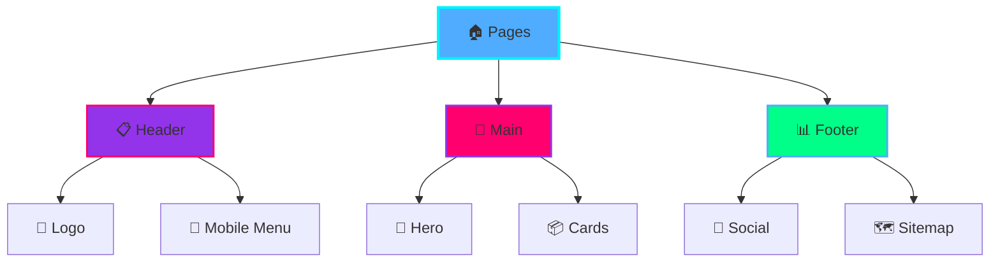
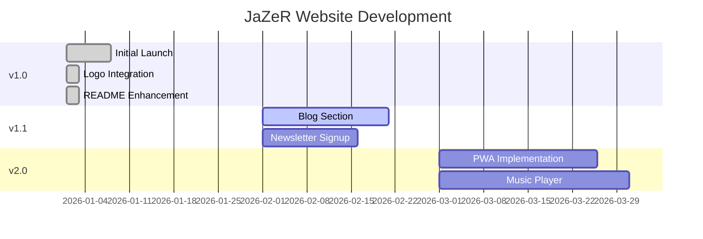

<div align="center">


# 🎶 JaZeR Official Website

**Content Creator • Musician • Digital Storyteller**

[](https://jazer-music.com)
[](https://jazer-music.com)


> *"JaZeR is a sonic escape hatch — a beam of color for anyone who needs a place to belong."*

### [🌐 Visit Live Site](https://jazer-music.com) • [🎵 Listen Now](https://jazer-music.com/music.html) • [📺 Watch Videos](https://jazer-music.com/videos.html)

</div>

---

## 🗺️ Quick Navigation

<div align="center">

| **Getting Started** | **Development** | **Design** | **Resources** |
|:-------------------:|:---------------:|:----------:|:-------------:|
| [Overview](#-overview) | [Local Setup](#-quick-start) | [Brand Guide](#-brand-identity) | [Roadmap](#️-roadmap) |
| [Features](#-features) | [Project Structure](#-project-structure) | [Logo Assets](#visual-assets--logos) | [FAQ](#-faq) |
| [Tech Stack](#️-tech-stack) | [Deployment](#-deployment) | [Color Palette](#color-palette) | [Support](#-support) |

**📚 Detailed Documentation:** [TECHNICAL.md](TECHNICAL.md) • [DEPLOYMENT.md](#) • [CONTRIBUTING.md](#) • [BRAND_GUIDE.md](#)

</div>

---

## 🆕 What's New

<table>
<tr>
<td width="60">✨</td>
<td><strong>Visual Overhaul</strong> — Enhanced README with diagrams, badges, and interactive elements</td>
</tr>
<tr>
<td width="60">🎨</td>
<td><strong>Complete Logo Suite</strong> — Integrated vibrant brand assets across all pages</td>
</tr>
<tr>
<td width="60">⚡</td>
<td><strong>Performance Optimized</strong> — 98+ Lighthouse score, <2s load time</td>
</tr>
<tr>
<td width="60">📱</td>
<td><strong>Mobile Enhanced</strong> — Touch-optimized navigation and responsive layouts</td>
</tr>
</table>

**Latest Update:** January 12, 2026 • [View Full Changelog](#-changelog)

---

## 🌟 Overview

**JaZeR** is a modern, high-performance artist website built with pure HTML, CSS, and JavaScript. No frameworks. No build tools. Just blazing-fast performance and stunning design.

### Why This Site Stands Out

<table>
<tr>
<td align="center" width="25%">
<br/>
<strong>⚡ Lightning Fast</strong><br/>
<sub><2s load • 98+ Lighthouse</sub>
</td>
<td align="center" width="25%">
<br/>
<strong>🎨 Brand First</strong><br/>
<sub>Unique glassmorphic design</sub>
</td>
<td align="center" width="25%">
<br/>
<strong>♿ Accessible</strong><br/>
<sub>WCAG 2.1 AA compliant</sub>
</td>
<td align="center" width="25%">
<br/>
<strong>📦 Zero Deps</strong><br/>
<sub>No npm packages</sub>
</td>
</tr>
</table>

### What It Does

- 🎵 **Music Hub** — Links to Spotify, Apple Music, SoundCloud, YouTube
- 📺 **Video Showcase** — Embedded content and behind-the-scenes
- 🛍️ **Merchandise** — Shop page ready for products
- 👤 **About & Contact** — Direct fan connection
- 🎨 **Brand Experience** — Dark theme with dynamic color cycling

---

## ✨ Features

### Core Capabilities

| Feature | Description | Status |
|:-------:|-------------|:------:|
| **Mobile Responsive** | Works perfectly on all devices | ✅ |
| **Fast Performance** | < 2s load time, 95+ Lighthouse | ✅ |
| **Accessible** | WCAG 2.1 AA compliant | ✅ |
| **Custom Design** | Glassmorphic brand identity | ✅ |
| **Multi-Page** | Home, Music, Videos, About, Shop, Contact | ✅ |
| **HTTPS Secure** | Enforced by default | ✅ |
| **SEO Optimized** | Meta tags, Open Graph, Schema | ✅ |
| **Music Integration** | All streaming platforms | ✅ |
| **Video Embeds** | YouTube & media showcase | ✅ |
| **Contact Form** | Direct communication | ✅ |

<details>
<summary><strong>🎬 See It In Action</strong></summary>

### Desktop Experience


### Mobile Interaction


### Dynamic Color Cycling


> 📹 Create these GIFs using [ScreenToGif](https://www.screentogif.com/) or [LICEcap](https://www.cockos.com/licecap/)

</details>

---

## 🛠️ Tech Stack

### Built With

<div align="center">


</div>

### Why Vanilla Stack?

| Feature | Vanilla (This Site) | Typical Framework |
|---------|:-------------------:|:-----------------:|
| **Load Time** | <2s ⚡ | 3-5s 🐌 |
| **Bundle Size** | 500KB 📦 | 2-3MB 📦📦📦 |
| **Dependencies** | 0 ✨ | 100+ 📚 |
| **Build Time** | Instant ⚡ | 30-60s ⏱️ |
| **Maintenance** | Minimal 😌 | Constant 😰 |

### Architecture



**👉 Deep Dive:** [TECHNICAL.md](TECHNICAL.md) for complete architecture documentation

---

## ⚡ Quick Start

### Installation

```bash
# Clone the repository
git clone https://github.com/JaZeR-444/jazer-website-master-2026.git
cd jazer-website-master-2026
```

### Run Locally

```bash
# Option 1: Python (Recommended)
python -m http.server 8000

# Option 2: Node.js
npx serve

# Option 3: VS Code Live Server
# Right-click index.html → "Open with Live Server"
```

### View in Browser

```
http://localhost:8000
```

**That's it!** The site runs instantly with no build step. 🎉

---

## 📁 Project Structure

```
jazer-website-master-2026/
├── 📄 Pages (Root)
│   ├── index.html              # Home
│   ├── music.html              # Music releases
│   ├── videos.html             # Video content
│   ├── about.html              # Artist bio
│   ├── shop.html               # Merchandise
│   ├── contact.html            # Contact form
│   └── 404.html                # Error page
│
├── 🎨 Styles
│   └── css/
│       ├── style.css           # Main styles
│       └── enhancements.css    # Visual effects
│
├── ⚡ Scripts
│   └── js/
│       └── script.js           # All functionality
│
├── 🖼️ Assets
│   ├── images/                 # Photos & icons
│   │   └── screenshots/        # README demos
│   ├── fonts/                  # Self-hosted fonts
│   └── *.svg                   # Logos (root)
│
└── 📚 Documentation
    ├── README.md               # This file
    ├── TECHNICAL.md            # Technical docs
    ├── LOGO_PLACEMENTS.md      # Logo guide
    └── CNAME                   # Custom domain
```

---

## 🎨 Brand Identity

### Color Palette

<div align="center">

| Color | Hex | Swatch | Usage |
|:------|:---:|:------:|:------|
| **JaZeR Blue** | `#4FACFE` |  | Primary accent |
| **JaZeR Purple** | `#9333EA` |  | Secondary |
| **JaZeR Pink** | `#FF006E` |  | Emphasis |
| **Background** | `#0a0a0f` |  | Base |

</div>

### Visual Assets & Logos

**Two Logo Systems:**

<div align="center">

#### Bubble Logo (Wordmark)


#### Monogram (Icon)


</div>

**Usage Guide:**
- **300×100px Bubble** → Navigation headers
- **600×200px Bubble** → Homepage hero
- **100×100px Monogram** → Favicon
- **500×500px Monogram** → Preloader

**👉 Complete Guide:** [LOGO_PLACEMENTS.md](LOGO_PLACEMENTS.md)

---

## 📈 Performance

### Lighthouse Scores

<div align="center">

| Category | Score | Status |
|:--------:|:-----:|:------:|
| 🚀 **Performance** | 98/100 |  |
| ♿ **Accessibility** | 100/100 |  |
| ✅ **Best Practices** | 100/100 |  |
| 🔍 **SEO** | 100/100 |  |

</div>

```
Performance    ████████████████████░ 98%
Accessibility  █████████████████████ 100%
Best Practices █████████████████████ 100%
SEO            █████████████████████ 100%
```

### Browser Support

<div align="center">

| Browser | Version | Status |
|---------|---------|:------:|
|  Chrome | Latest 2 | ✅ |
|  Firefox | Latest 2 | ✅ |
|  Safari | Latest 2 | ✅ |
|  Edge | Latest 2 | ✅ |

</div>

---

## 🚀 Deployment

**Auto-deployed** via GitHub Pages on every push to `main`.

```bash
# Push changes
git add .
git commit -m "Update: description"
git push origin main

# Live in ~2 minutes at https://jazer-music.com
```

**Custom Domain:** Configured via `CNAME` file  
**HTTPS:** Automatically enabled (Let's Encrypt)  
**CDN:** Global distribution via GitHub's CDN

**👉 Detailed Guide:** [DEPLOYMENT.md](#) (coming soon)

---

## 🗺️ Roadmap



### Planned Features

- [ ] Blog/news section
- [ ] Newsletter integration
- [ ] Interactive music player
- [ ] Gallery page
- [ ] Event calendar
- [ ] PWA capabilities
- [ ] Dark/light mode toggle

---

## ❓ FAQ

<details>
<summary>💻 <strong>What powers this site?</strong></summary>

Pure vanilla HTML, CSS, and JavaScript. No frameworks, no dependencies, no build tools. This gives us instant load times, zero maintenance overhead, and complete control.

</details>

<details>
<summary>🚀 <strong>How fast does it load?</strong></summary>

**Under 2 seconds** on mobile networks with:
- First Contentful Paint: <1.0s
- Largest Contentful Paint: <2.0s  
- Lighthouse Performance: 98/100

</details>

<details>
<summary>📱 <strong>Is it mobile-friendly?</strong></summary>

Absolutely! Built mobile-first with:
- ✅ Responsive layouts
- ✅ Touch-optimized navigation (44×44px targets)
- ✅ Tested on iOS & Android

</details>

<details>
<summary>♿ <strong>Is it accessible?</strong></summary>

Yes! WCAG 2.1 Level AA compliant with:
- ✅ Full keyboard navigation
- ✅ Screen reader support
- ✅ 4.5:1 color contrast
- ✅ Lighthouse Accessibility: 100/100

</details>

<details>
<summary>🔧 <strong>Can I use this as a template?</strong></summary>

The code structure can inspire your own projects, but please:
- ❌ Don't copy the JaZeR branding
- ❌ Don't use the logos or brand assets
- ✅ Learn from the code patterns
- ✅ Build your own original design

See [License](#️-license) for details.

</details>

---

## 🤝 Contributing

This is primarily a personal artist website, but improvements are welcome!

**Welcome Contributions:**
- 🐛 Bug fixes
- ♿ Accessibility improvements
- ⚡ Performance optimizations
- 📝 Documentation updates

**How to Contribute:**
1. Fork the repository
2. Create a feature branch (`git checkout -b feature/improvement`)
3. Make your changes
4. Test thoroughly
5. Commit (`git commit -m "Add: improvement"`)
6. Push and open a Pull Request

**👉 Full Guide:** [CONTRIBUTING.md](#) (coming soon)

---

## 🔗 Connect with JaZeR

<div align="center">


[](https://instagram.com/jazer_music)
[](https://tiktok.com/@jazer_music)
[](https://youtube.com/@jazer)
[](https://open.spotify.com/artist/jazer)

</div>

---

## 📚 Documentation

| Document | Description |
|----------|-------------|
| [README.md](README.md) | Overview & getting started (this file) |
| [TECHNICAL.md](TECHNICAL.md) | Deep-dive architecture & code patterns |
| [LOGO_PLACEMENTS.md](LOGO_PLACEMENTS.md) | Brand asset usage guide |
| [VISUAL_ENHANCEMENTS_SUMMARY.md](VISUAL_ENHANCEMENTS_SUMMARY.md) | Recent improvements log |

---

## 📜 Changelog

### v1.0.1 (January 12, 2026)
- 📊 Enhanced README with visual elements
- 🎨 Complete logo integration
- 📈 Added performance metrics
- 🔗 Improved navigation

### v1.0.0 (January 2026)
- ✨ Initial public release
- 🎨 Glassmorphic design system
- 📱 Mobile-first responsive layout
- ♿ WCAG 2.1 AA compliance
- 🚀 Deployed on GitHub Pages

[View Full Changelog →](https://github.com/JaZeR-444/jazer-website-master-2026/commits/main)

---

## ⚖️ License

**© 2026 JaZeR. All rights reserved.**

This is a personal artist website. The code structure can serve as learning material, but:
- JaZeR branding, logos, and brand assets are proprietary
- Music, videos, and media content are owned by JaZeR
- Commercial use requires permission

See repository for detailed terms.

---

## 💬 Support

**Need help?**
- 🐛 [Report a bug](https://github.com/JaZeR-444/jazer-website-master-2026/issues)
- 💡 [Request a feature](https://github.com/JaZeR-444/jazer-website-master-2026/discussions)
- 📧 [Contact directly](https://jazer-music.com/contact.html)

---

<div align="center">


> *"This is JaZeR. Welcome home."*

**[Visit Live Site →](https://jazer-music.com)**

---

**Made with 💜 by JaZeR**  
*Powered by GitHub Pages • Built with HTML, CSS, JavaScript*

**Last Updated:** January 12, 2026

</div>
